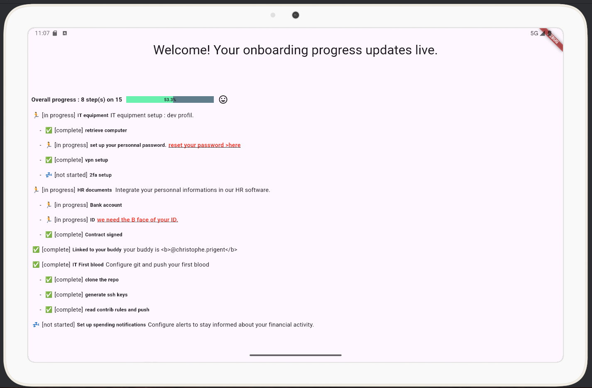

# Onboarding Assistant

 onboarding progress updates live dashboard.



## Description

A Dart/Flutter project to ease newcomers onboarding.

## Features
- **multiplatform** : ios, android, windows, linux, mac, and web.
- **real time data updates**
- **dynamic**: use external json endpoint to get data.
- **workflow**: allow CTA to trigger workflow.
- **clear**: easy to read and understand.

## Installation

1. clone the repo : `git clone https://github.com/superT0f/onboarding.git`
2. follow flutter installation instructions : https://docs.flutter.dev/get-started/install
3. install flutter extension for your favorite IDE : 
  - Visual Studio Code 
  - Android Studio 
  - IntelliJ IDEA 

## Getting Started

This project is a proof of concept and does not use real data. 
To get started, you will need a backend web service 
that provides data in the following JSON format:

```json lines
[
    {
        "title": "Task Title",
        "status": "in progress|complete|not started",
        "description": "Task description",
        "subtasks": [
            {
                "title": "Subtask Title",
                "status": "complete|in progress|not started",
                "alert": "Optional warning or important message"
            }
            /* Additional subtasks can be added here */
        ]
    }
    /* Additional tasks can be added here */
]
```
